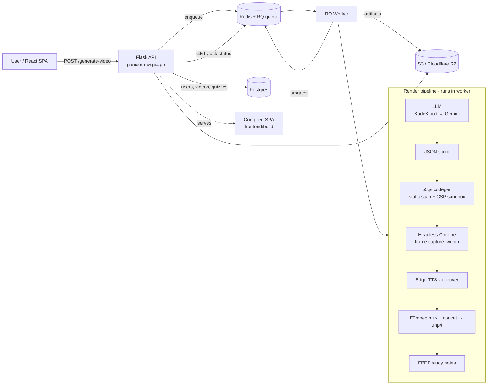

<div align="center">

# 🧠 Shiksha

**Type a topic → get a narrated, animated lesson video with a quiz and PDF notes.**

[**▶ Live demo**](https://krishivvv-shikshaai.hf.space) · [Architecture](#architecture) · [Quickstart](#quickstart) · [Deployment](DEPLOYMENT.md)


[](https://krishivvv-shikshaai.hf.space)

</div>

> Shiksha turns one prompt (or an uploaded PDF) into a complete educational video: an LLM writes a segmented script, generates `p5.js` animation code that is **safety-checked and rendered in a headless browser**, narrates it with neural TTS, and FFmpeg stitches the segments into a final `.mp4` — then it generates a quiz and a PDF of study notes.

<!-- Replace with a 10–15s screen capture of: prompt → live pipeline progress → final video playing. -->


---

## Architecture



| Layer | Tech | Where |
|---|---|---|
| Frontend | React 19 + Vite (SPA) | [`frontend/vidlearn-frontend-main/`](frontend/vidlearn-frontend-main/) → builds to `frontend/build/` |
| API / web | Flask + gunicorn | [`shiksha/api/`](shiksha/api/), [`wsgi.py`](wsgi.py) |
| Pipeline | LLM → p5.js → Pyppeteer → Edge-TTS → FFmpeg → FPDF | [`shiksha/pipeline/`](shiksha/pipeline/) |
| Async | RQ + Redis (thread fallback) | [`shiksha/services/tasks.py`](shiksha/services/tasks.py) |
| Data | Postgres (psycopg3) / SQLite | [`shiksha/models/`](shiksha/models/) |
| Storage | Local FS / S3 / Cloudflare R2 | [`shiksha/services/storage.py`](shiksha/services/storage.py) |
| Hardening | Talisman CSP/HSTS · Flask-WTF CSRF · Flask-Limiter · pydantic validation | [`shiksha/__init__.py`](shiksha/__init__.py), [`shiksha/api/schemas.py`](shiksha/api/schemas.py) |

---

## Quickstart

```bash
# 1) Backend
python -m venv .venv && . .venv/Scripts/activate    # Windows
# source .venv/bin/activate                         # macOS / Linux
pip install -r requirements.txt

cp .env.example .env        # set SECRET_KEY + at least one LLM key (see below)
python wsgi.py              # dev server → http://localhost:5000
# prod:  gunicorn wsgi:app

# 2) Background worker (needs Redis running)
rq worker video --url "$REDIS_URL"

# 3) Frontend (only if changing the UI)
cd frontend/vidlearn-frontend-main && npm install && npm run build
```

Or run the whole stack (web + worker + Redis + Postgres) with one command:

```bash
docker compose up --build      # http://localhost:8000  ·  GET /health → 200
```

**Required env** (full list in [.env.example](.env.example)):

| Variable | Notes |
|---|---|
| `SECRET_KEY` | `python -c "import secrets; print(secrets.token_hex(32))"` |
| `GOOGLE_API_KEY` *or* `KODEKLOUD_API_KEY` | At least one LLM provider |
| `REDIS_URL` | Local Redis or free Upstash; powers the queue, progress + rate limiter |
| `DATABASE_URL` | SQLite by default; Postgres in production |

---

## Health & results

`GET /health` reports each dependency independently and returns `503` if any
critical one is down — handy for load balancers and the compose healthcheck:

```json
{ "status": "ok",
  "checks": { "database": {"ok": true}, "redis": {"ok": true},
              "chrome": {"ok": true}, "ffmpeg": {"ok": true} } }
```

**Sample output:** a prompt like *"Explain how binary search works"* yields a
~60–90s narrated `.mp4` of animated segments plus a multi-question quiz and a
study-notes PDF. (Drop a real sample under `docs/` and link it here.)

---

## Security

- **Generated code is untrusted** and double-sandboxed: a static scan rejects
  network/storage/`eval` APIs, and the render HTML runs under a restrictive CSP
  (`connect-src 'none'`). See [`shiksha/pipeline/orchestrator.py`](shiksha/pipeline/orchestrator.py).
- CSRF (Flask-WTF), rate limits (Flask-Limiter), and pydantic schemas guard every
  state-changing route; Talisman sets CSP/HSTS/`X-Frame-Options`.
- Secrets live only in `.env` (gitignored). A sample nginx TLS config is in [nginx.txt](nginx.txt).

See [DEPLOYMENT.md](DEPLOYMENT.md) for the production split, managed-service wiring, and the migration release step.

---

<div align="center"><sub>Built by Krishiv · <a href="LICENSE">MIT</a></sub></div>
